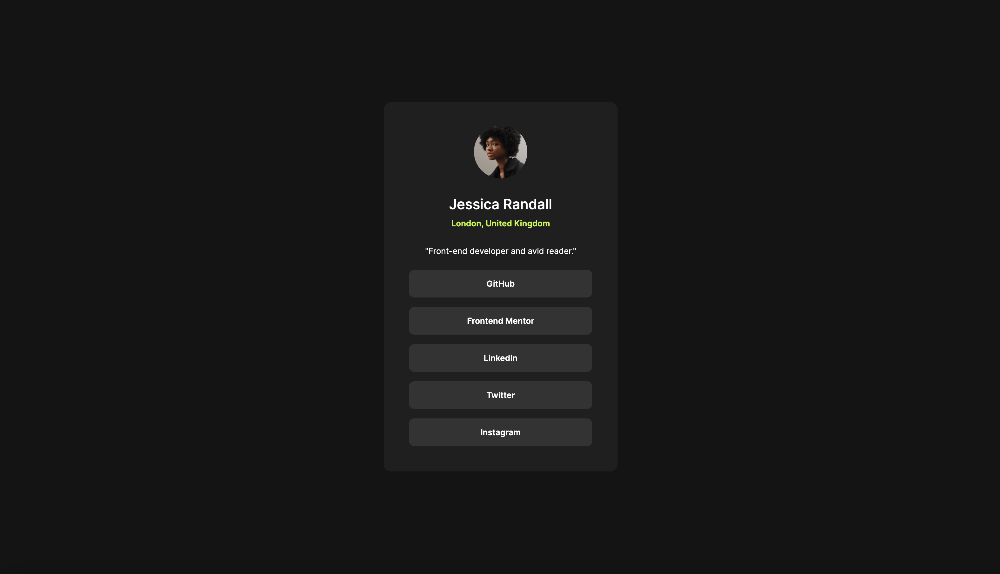

# Frontend Mentor - Social links profile solution

This is a solution to the [Social links profile challenge on Frontend Mentor](https://www.frontendmentor.io/challenges/social-links-profile-UG32l9m6dQ). Frontend Mentor challenges help you improve your coding skills by building realistic projects.

## Table of contents

- [Overview](#overview)
  - [The challenge](#the-challenge)
  - [Screenshot](#screenshot)
  - [Links](#links)
- [My process](#my-process)
  - [Built with](#built-with)
  - [What I learned](#what-i-learned)
- [Author](#author)

## Overview

### The challenge

Users should be able to:

- See hover and focus states for all interactive elements on the page

### Screenshot

### Links

- Solution URL: [https://github.com/maryam-nasir/fm-social-links-profile](https://github.com/maryam-nasir/fm-social-links-profile)
- Live Site URL: [https://maryam-nasir.github.io/fm-social-links-profile](https://maryam-nasir.github.io/fm-social-links-profile)

## My process

### Built with

- Semantic HTML5 markup
- Tailwind CSS
- Flexbox

### What I learned

I styled this project using Tailwind CSS which I'm learning nowadays. It was a great exercise to apply my Tailwind CSS skills and help solidify my understanding of the framework.

## Author

- LinkedIn - [Maryam Nasir](https://www.linkedin.com/in/maryam-nasir/)
- Frontend Mentor - [@maryam-nasir](https://www.frontendmentor.io/profile/maryam-nasir)
- Twitter - [@maryamnasir555](https://twitter.com/maryamnasir555)
